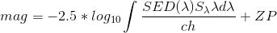

# Code to do K-S-MW correction at the same time

## 1) Background

The photon flux observed in one photometric system is affected by different sources: the dust in our Milky Way (AvG), the expansion of the Universe (K-correction; Oke & Sandage 1968; Hamuy et al. 1993; Kim et al. 1996; Nugent et al. 2002), and the host-galaxy extinction (Avh), and by the difference between the natural photometric system used to obtain observations and the standard photometric system (S-correction; Stritzinger et al. 2002).  

The basic idea of this correction is to put all the observed supernovae from different surveys (= different photometric systems), at different redshifts, and with different Milky Way extinctions, in the same photometric system and in the restframe.  

**This correction is called AKS**  

**1.1) Milky Way extinction**

Dust extinction in our Galaxy is due to small and solid grains of heavy elements formed in the core of massive stars and ejected in the interstellar medium by stellar winds and SN explosions (Draine 2003). Dust scatters and absorbs more blue light than red light, and therefore SNe with large extinction will be characterised by a redder continuum. To correct for AvG, we can use the value derived by Schlafly & Finkbeiner (2011).  

**1.2) K-correction**
The K-correction first introduced by Hubble (1936) allows us to correct the observed magnitude by a factor imputable to the redshift caused by the expansion of space (see the short pedagogical paper by Hogg et al. 2002 but also Oke & Sandage 1968; Hamuy et al. 1993; Kim et al. 1996; Nugent et al. 2002). For example, a photon emitted by a SN at z=0.45 in the B band
will be observed on the Earth in the R band. The more distant is the object the more important this effect will be.

**1.3) S-correction**
To combine SNe from different samples, we need to put all the data in the same standard system in order to minimise systematic effects (S-correction; Stritzinger et al. 2002).

**1.4) Host-galaxy correction**
To date, no accurate methods are available to calculate the extinction from the host-galaxy dust. For this purpose in this code we did not correct for this.

## 2) Codes  

This code is useful to transform **BVRI** photometric data obtained with Kait2,Kait3,Kait4,Nickel1,Nickel2 filters to the Carnegie Supernova Project (CSP) photometric system **BVri**. We use only 4 SNe for which we have CSP and KAIT data.   

**2.1) Folders**  
+ AKS_mag: The photometry obtained after K-S- MW correction. If everything works well, this photometry should be very similar to the photometry obtained using CSP  

+ CSP_photo: CSP photometry of 4 SNe, after K and MW correction. The photometry were calculted by my self, and I put directly the result there. You can not obtain using the codes.  

+ Figures: 5 plots: A comparison of the different filters between CSP and KAIT/Nickel. The main difference is between I (KAIT) and i (CSP)   

+ Models: To apply the AKS, you need a spectral energy distribution (SED). As SED we take the SN models obtained by Dessart al. 2013.  

+ Nat_KAIT: Kait/Nickel magnitudes in the natural system for 4 SNe. These are the raw data we want to transform to the CSP system. As you can see in the folder Figures, these magnitudes differ from those of CSP and therefore we can not compare both magnitude.  

**2.2) Method**  

You need to run KAIT_AKS.py.  

+ Get the general SN info: explosion date, Milky Way extinction, redshift. This should be written by hand in a file called: Infos_SNe_kait.txt

+ Get the observed photometry of your object: MJD,mags,emags,tel

+ Get the transmission function of all the filters (CSP and KAIT). You need to know the ZP of each band and photometric system to convert magnitude into flux:    mag = -2.5*log10(flux) + ZP

+ At each photometric epoch you will get the theoretical model with the closest epoch. Then you will warp/mangle the model to match the observed photometry. For this purpose, from the spectrum (in the observed frame) you calculate the synthetic magnitude using the KAIT filters:  

